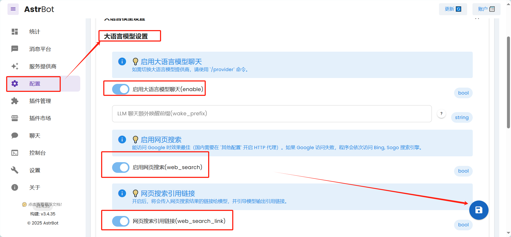

# 1. 使用教程
## 1.1 软件安装（课前准备）
### 1.1.1 安装VS Code
教程链接：[https://zhuanlan.zhihu.com/p/698865320](https://zhuanlan.zhihu.com/p/698865320)
### 1.1.2 安装Git
教程链接：[https://www.cnblogs.com/ybqjymy/p/17226628.html](https://www.cnblogs.com/ybqjymy/p/17226628.html)

在选择默认编辑器时可以选用VSCode作为默认编辑器：


创建一个GitHub账号，打开GitBash，输入命令配置账户：
```shell
git config –-global user.email “you@example.com”

git config –-global user.name “Your name”
```
### 1.1.3 安装Docker Desktop
下载链接：[https://www.docker.com/get-started/](https://www.docker.com/get-started/)

下载完成之后，可以注册一个账号并登录，并且按照下图配置镜像源：


添加镜像源：
```json
"registry-mirrors": [
    "https://docker-0.unsee.tech",
    "https://docker-cf.registry.cyou",
    "https://docker.1panel.live"
]
```


## 1.2 docker一键部署开源项目AstrBot
AstrBot项目链接：https://github.com/Soulter/AstrBot


```shell
# 切换到要放置项目的文件夹位置
cd 放置项目的文件夹位置
```

```shell
git clone https://github.com/Soulter/AstrBot

cd AstrBot

docker compose up -d
```

直接按照教程Docker部署后，可以通过网址：http://localhost:6185 打开AstrBot控制面板。打开控制面板时可能会遇到问题，可以参考：https://astrbot.app/faq.html

配置LLM教程：

硅基流动获取API密钥：https://cloud.siliconflow.cn/models


AstrBot配置LLM：


将之前获取的API密钥和文本生成模型名称分别填入，并点击保存：

开启大语言模型设置：

接下来就可以在AstrBot中使用啦：
